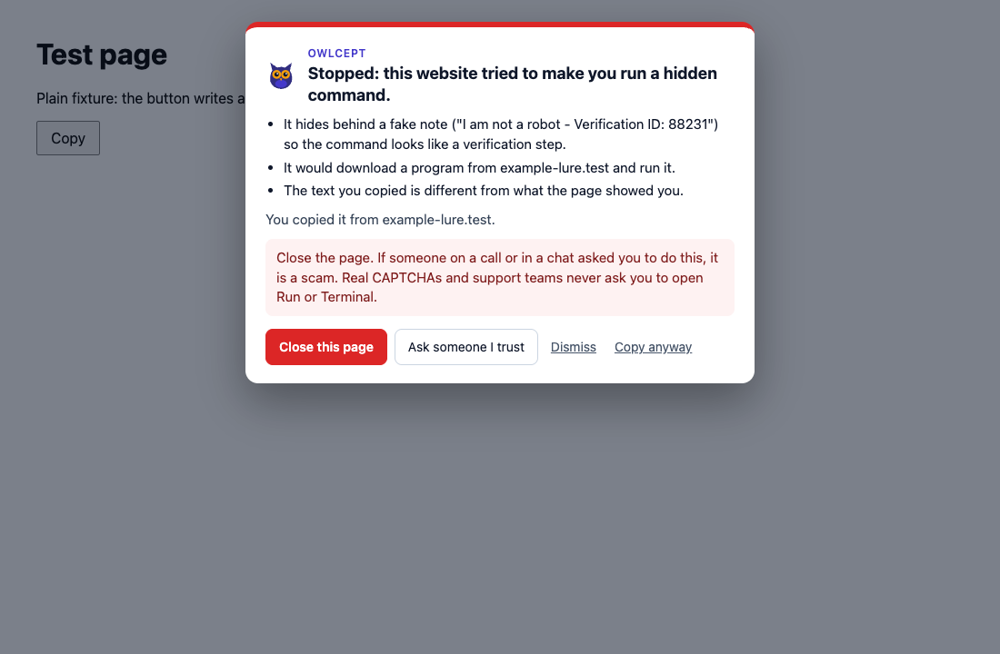
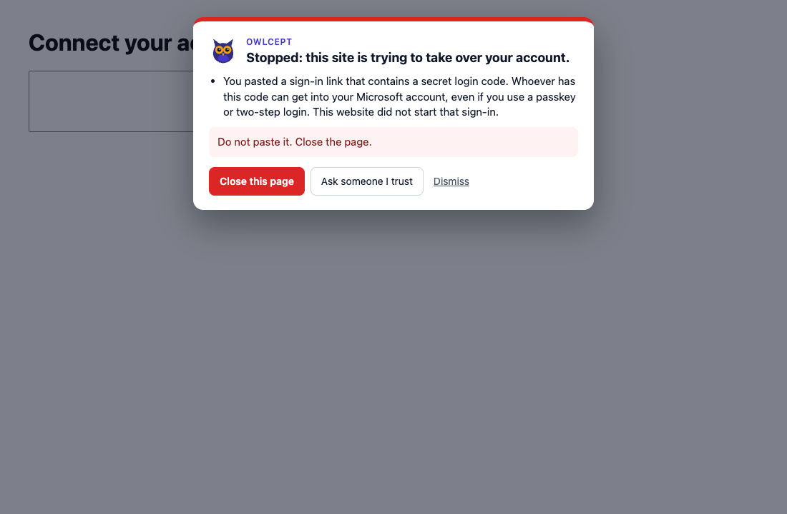
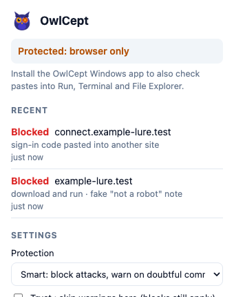
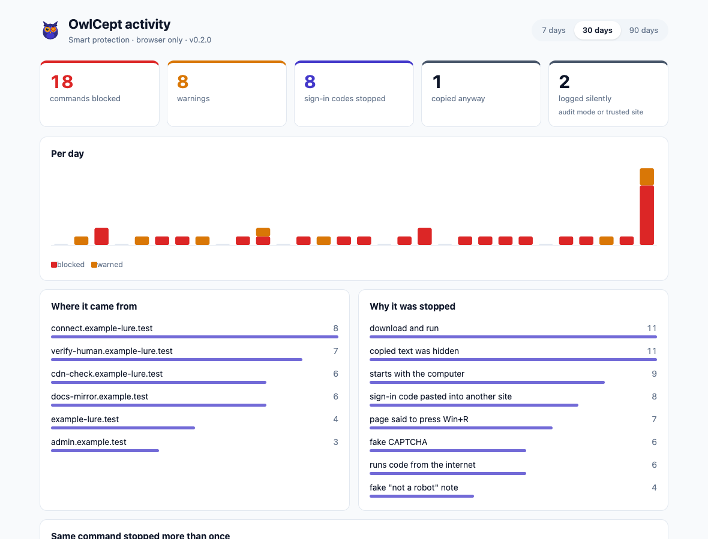
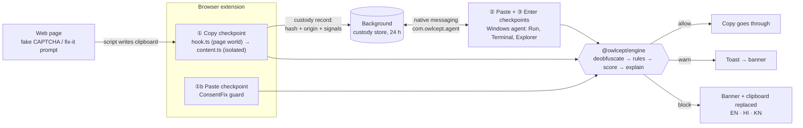
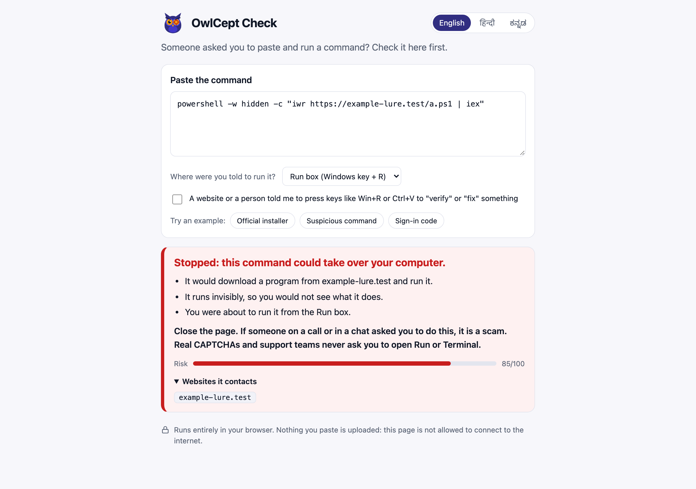
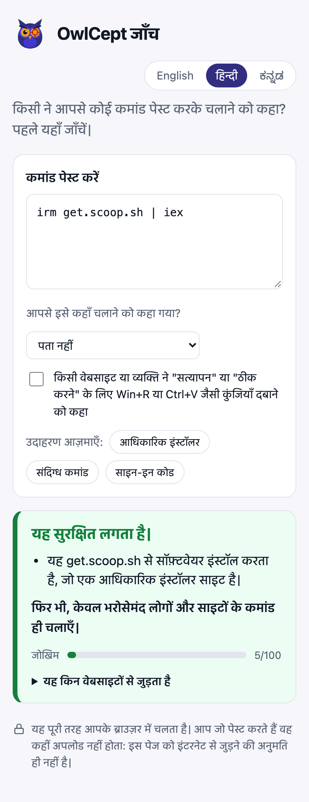

<div align="center">

<picture>
  <source media="(prefers-color-scheme: dark)" srcset="docs/assets/owlcept-banner-dark.svg">
  
</picture>

### Stops fake-CAPTCHA "paste and run" (ClickFix) attacks at copy, paste and Enter, and explains them in plain English, Hindi and Kannada.

[](https://github.com/sidhy4rth/OwlCept/actions/workflows/engine.yml)
[](https://github.com/sidhy4rth/OwlCept/actions/workflows/extension.yml)
[](https://github.com/sidhy4rth/OwlCept/actions/workflows/web.yml)
[](https://github.com/sidhy4rth/OwlCept/actions/workflows/android.yml)
[](docs/BENCHMARK.md)
[](docs/DEPLOY.md)
[](https://github.com/sidhy4rth/OwlCept/actions/workflows/codeql.yml)
[](https://github.com/sidhy4rth/OwlCept/releases/latest)
[](LICENSE)


[**Download**](https://github.com/sidhy4rth/OwlCept/releases/latest) ·
[**How it works**](#how-it-works) ·
[**Benchmark**](docs/BENCHMARK.md) ·
[**Threat model**](docs/THREAT-MODEL.md) ·
[**Deploy in a college**](docs/DEPLOY.md) ·
[**Tech stack**](#tech-stack)

</div>

<br>

<p align="center">
  
</p>
<p align="center"><sub>A page's "Copy" button quietly wrote a PowerShell download-and-run command behind a fake "I am not a robot" note. OwlCept stopped the copy, swapped the clipboard for a harmless line, and said why in plain words.</sub></p>

---

## At a glance

<table>
<tr>
<td align="center"><h3>3</h3>checkpoints<br><sub>copy · paste · Enter</sub></td>
<td align="center"><h3>14</h3>de-obfuscation<br>layers peeled</td>
<td align="center"><h3>48</h3>named signals<br><sub>behaviour, disguise,<br>provenance, source</sub></td>
<td align="center"><h3>3</h3>warning languages<br><sub>English · Hindi · Kannada</sub></td>
<td align="center"><h3>0 / 650</h3>false prompts<br><sub>on commands from<br>official docs</sub></td>
<td align="center"><h3>0</h3>bytes of clipboard<br>sent anywhere</td>
<td align="center"><h3>212</h3>tests<br><sub>160 unit + 52 in a<br>real browser</sub></td>
</tr>
</table>

**ClickFix** is the attack where a web page shows a fake CAPTCHA or error ("verify you are human: press Win+R,
Ctrl+V, Enter"), and its button has already put a malicious command on your clipboard. You paste it into the Run
box or a terminal yourself, so antivirus sees a user running a command, not an exploit. **ConsentFix** is its
cousin for accounts: the page asks you to paste a sign-in link, which carries an OAuth code that lets the attacker
into your Microsoft or Google account, passkey and two-step login included.

OwlCept watches the three moments that matter. It records where every copy came from, checks what the copied
text would actually do once its disguises are peeled off, and stops it before Enter, then tells the person,
in their own language, what the page tried to make them do.

---

## What it does

| | |
|---|---|
| **Catches the hidden copy** | A page script writing to the clipboard (`writeText`, `write`, `setData`, `execCommand('copy')`) is checked against what the page actually shows. Text that was never visible is flagged as a hidden copy. |
| **Reads past the disguise** | Base64 and `-EncodedCommand`, hex, `[char]` codes, `^` carets and backticks, `%VAR:~x,y%` slicing, split and quote-broken strings, `-replace` and `-f` reordering, URL encoding, zero-width characters and decoy padding are all unwrapped before any rule runs. |
| **Names the behaviour** | Download-and-run, remote `mshta`/`msiexec`/`regsvr32`/`rundll32`, `certutil` decoding, finger and DNS staging, Defender tampering, persistence, browser-data theft, reverse shells, macOS quarantine stripping and fake password prompts. |
| **Weighs the provenance** | Where the text came from (a script-written copy, a page with "press Win+R" lure words, a fake CAPTCHA, a docs site, an app) moves the score. Provenance alone never prompts; a hidden copy next to lure text always blocks. |
| **Blocks ConsentFix** | An OAuth code or sign-in redirect pasted into a site other than the one it was issued for is stopped at paste time. |
| **Explains it plainly** | "Stopped: this website tried to make you run a hidden command", with what it would do, where it came from and what to do now, in English, Hindi or Kannada. |
| **Ask someone I trust** | One tap sends the warning to a saved WhatsApp contact: a child, a colleague, the college IT desk. |
| **Knows where it came from** | A copy from WhatsApp Web, Teams, Gmail, Outlook, a PDF or a ChatGPT/Claude/Gemini answer is named in the warning ("It came from a chat message in WhatsApp Web…"), on the web and, through the agent, on the desktop. A source alone never prompts. |
| **Three protection modes** | **Smart** blocks attacks and warns on doubtful commands. **Strict** (family PCs) blocks anything doubtful. **Audit** (IT pilots) logs without ever interrupting. |
| **Trusted sites that cannot be abused** | Trusting a site skips its *warnings*, never its *blocks*: real sites get hacked to serve fake CAPTCHAs (700+ in the May 2026 Ghost CMS campaign). |
| **Activity dashboard** | What was stopped, where and why, a 30-day chart, the same command stopped on several pages, searchable history, CSV and JSON export, and a weekly WhatsApp summary for a trusted person. |
| **Opt-in lure reporting** | "Report this page" opens Google Safe Browsing's public report form with the lure URL filled in, and only when clicked. |
| **Runs a whole lab** | Colleges set and lock every setting by Group Policy or Intune ([deploy guide](docs/DEPLOY.md)), then drop every PC's export into the **fleet view** to see campaigns across devices. No server. |
| **Shows its work** | "How OwlCept read it, step by step": every layer it decoded, which decoder produced it and which disguises came off, in English, Hindi and Kannada (`owlcept check --trace` on the command line). |
| **Fails safe, not open** | A stress test feeds the engine 1,700 pathological inputs up to 200 KB in CI; the worst takes ~7 ms. Anything it cannot finish decoding within its 150 ms budget is at least a warning, never a silent pass. |
| **Organisation rules** | IT can block hosts (any command that would contact them is stopped) and approve exact commands by SHA-256 fingerprint (the college's own setup script never prompts). Policy-only: a page or the user cannot set them. |
| **Signed exports and incident reports** | Each browser signs its fleet exports with its own non-extractable ECDSA key; the fleet view rejects edited files. Every event has a printable incident report with tailored next steps and a signed evidence file. |
| **Measures its own explanations** | A review tool for the brief's "two reviewers score 50 warnings": seeded packs, keyboard scoring in three languages, accuracy against 90% and Cohen's κ. |
| **Keeps nothing readable** | Only a SHA-256 fingerprint of each copy is kept, for 24 hours. The web checker's Content-Security-Policy forbids every network connection. |

<table>
<tr>
<td width="62%"></td>
<td width="38%"></td>
</tr>
<tr>
<td><sub>ConsentFix: a Microsoft sign-in code pasted into a site that did not start the sign-in. The paste never lands.</sub></td>
<td><sub>The popup: what was stopped, warning language, and the trusted contact.</sub></td>
</tr>
</table>

<p align="center"></p>
<p align="center"><sub>The activity dashboard, also the extension's options page. Lure URLs are shown defanged; <i>Report</i> opens the public Safe Browsing form.</sub></p>

---

## How it works



1. **Copy.** `hook.ts` runs in the page's own JavaScript world at `document_start` and reports every clipboard
   write. The decision is made in the isolated content script, where page code cannot reach. Manual copies are
   recorded too, so the agent later knows the difference between "you selected this" and "a script put this here".
2. **Custody.** Each copy becomes a custody record (fingerprint, origin URL, script-written or not, visible or not,
   lure words, fake CAPTCHA) held by the background worker for 24 hours and shared with the Windows agent.
3. **Paste and Enter.** The Windows agent (in progress) checks pastes into Run, Terminal and File Explorer against
   that record, so a command copied from a lure page is blocked at the moment it would run.
4. **Verdict.** The engine scores behaviour plus provenance: `warn` at 35, `block` at 70. A block replaces the
   clipboard with a harmless comment line, so even a paste after dismissing the warning runs nothing.

---

## One engine, every way in

| Part | What it is | Status |
|---|---|---|
| [`packages/engine`](packages/engine) | Pure TypeScript risk and explanation engine. No dependencies, no network. Also ships as a single-file host bundle (`globalThis.OwlCept.analyzeJson`) for the Windows agent. | ✅ 94 tests |
| [`extension`](extension) | Edge and Chrome extension (Manifest V3): copy checkpoint, ConsentFix paste guard, warning banner, popup, native-messaging bridge to the agent. | ✅ tested in Chromium on every push |
| [`web`](web) | **OwlCept Check**: paste a command, see what it really does. Static, works from `file://`, CSP blocks every connection. | ✅ builds on every push |
| [`android`](android) | Kotlin app wrapping OwlCept Check offline: share target, "Check with OwlCept" on selected text, clipboard button, Quick Settings tile. **Zero permissions.** | ✅ APK on every release |
| [`web/fleet.html`](web/README.md#fleet-view) | **Fleet view**: drop in every PC's export; signatures verified, per-device counts, campaigns across devices, audit-mode near-misses, and **one-click blocklist policy** (PowerShell, .reg, JSON) from the lure sites. Offline. | ✅ tested with hostile, edited and re-keyed files |
| [`web/review.html`](web/README.md#warning-review) | **Warning review**: score a pack of real warnings, merge two reviewers into accuracy and Cohen's κ. | ✅ full two-reviewer run in CI |
| [`packages/engine/cli`](packages/engine/cli/owlcept.ts) | **`owlcept` CLI**: `check`, `oauth`, and a JSON-lines `serve` mode for the agent; exit status 0/1/2 for allow/warn/block. | ✅ single-file release asset |
| [`bench`](bench) | Benchmark harness against the brief's targets. 650 commands from official docs ship with it; the team's defanged attack corpus drops in as JSONL. | ✅ [report](docs/BENCHMARK.md) in CI |
| [`deploy`](deploy) | Policy script for Chrome and Edge, example `.reg`, Native Messaging host manifest. | ✅ tested on a Windows runner |
| `agent` | Windows agent: clipboard listener plus paste and Enter checks for Run, Terminal and Explorer. | 🛠️ team in progress |

<p align="center">
  
  &nbsp;
  
</p>

---

## Install

**Browser extension (Edge or Chrome)**

1. Download `OwlCept-extension-*.zip` from the [latest release](https://github.com/sidhy4rth/OwlCept/releases/latest) and unzip it.
2. Open `edge://extensions` or `chrome://extensions`, turn on **Developer mode**.
3. Click **Load unpacked** and choose the unzipped folder.

**Android:** install `OwlCept-android-*-debug.apk` from the same release.

**Web checker and fleet view:** unzip `OwlCept-check-web-*.zip` and open `index.html` or `fleet.html`. No server needed.

**CLI:** `node OwlCept-cli-*.mjs check "irm get.scoop.sh | iex" --target terminal` (Node 18+).

**A whole college or office:** see [docs/DEPLOY.md](docs/DEPLOY.md): settings by Group Policy or Intune, audit-first rollout, fleet view.

---

## Tech stack

| Layer | Technology |
|---|---|
| Engine | TypeScript 5.9 (strict), zero runtime dependencies, Node 24 native test runner with type stripping |
| Extension | Chrome Manifest V3: MAIN-world + isolated content scripts, module service worker, `chrome.storage`, Native Messaging, closed Shadow DOM banner, Web Crypto SHA-256 |
| Bundling | esbuild 0.25 (IIFE content scripts, ESM worker, minified) |
| Web checker | Vanilla TypeScript + HTML/CSS, strict Content-Security-Policy (`connect-src 'none'`), works offline |
| Android | Kotlin 2.0, Android Gradle Plugin 8.7, SDK 35 (min 26), AndroidX WebKit `WebViewAssetLoader`, Quick Settings `TileService`, `PROCESS_TEXT` and share intents |
| Windows agent | Team in progress; embeds the same engine through its single-file host bundle |
| Testing | `node:test` unit tests; Playwright 1.63 loads the built extension into real Chromium (modes, dashboard, export, and a network capture proving 0 bytes leave); the fleet view is tested with hostile files |
| Benchmark | `bench/run.ts`: copy, paste and commit checkpoints per sample, false-prompt rate, latency p95, warning coverage in 3 languages; `bench/stress.ts`: worst case on 1,700 pathological inputs; `bench/review-pack.ts`: seeded review samples. All fail CI on a regression |
| Cryptography | WebCrypto ECDSA P-256 (non-extractable device keys in IndexedDB, signatures over canonical JSON); a pure-TypeScript SHA-256 so fingerprints match inside hosts without WebCrypto |
| Deployment | `chrome.storage.managed` schema, PowerShell policy script for Chrome and Edge (tested on `windows-latest`), fixed extension ID via the manifest key; a real managed-policy file is read by Chromium in Linux CI |
| CI/CD | GitHub Actions: one workflow per part plus Benchmark and Deployment kit, CodeQL (TypeScript + Actions), tag-triggered release that attaches the extension zip, web zip, APK and CLI |
| Logo | Hand-written SVG with CSS keyframes (`scripts/logo.mjs`), rendered to MP4/GIF with Playwright + ffmpeg; honours `prefers-reduced-motion` |

---

## The owl

<p align="center">
  
</p>

He reaches behind his back, draws the rifle over his shoulder, closes one eye, scopes in on the `>_` prompt
someone wanted you to run, and takes the shot. One 6-second loop in a 12 KB SVG. It plays anywhere an image
does and holds the aim pose for people who prefer reduced motion. MP4 and GIF cuts are in
[`docs/assets`](docs/assets); `npm run logo` rebuilds all of it.

---

## Develop

```bash
npm ci
npm test                                   # engine + extension unit tests
npm run bench                              # benchmark → docs/BENCHMARK.md
npm run stress                             # worst-case timing on pathological input
npm run review-pack                        # warning-review sample → bench/review/pack.json
npm run build                              # extension → extension/dist, web → web/dist
npx playwright install chromium
npm run test:browser                       # extension (22 checks) and web pages (25) in Chromium
npm run owlcept -- check "git status" --trace   # the CLI from source
npm run owlcept -- hash "<command>"        # fingerprint for the approvedCommands policy
cd android && ./gradlew assembleDebug      # after npm run build -w @owlcept/web; needs JDK 17
```

Every attack sample in the tests is defanged: hosts are fictional `*.test` names that never resolve, and nothing
is ever executed.

---

## Privacy

Full detail, including where OwlCept can be beaten and what backs it up, is in the
[threat model and privacy note](docs/THREAT-MODEL.md).

- Clipboard text is analysed on the device and never sent anywhere. The browser test captures every request in a full run and fails on anything but its own pages.
- The extension keeps only a SHA-256 fingerprint of each copy plus its origin, for 24 hours.
- "Ask someone I trust" opens WhatsApp with the warning text only when the person taps it.
- The activity log keeps hosts, finding ids and fingerprints; full URLs only for lure pages, so they can be reported.
- The web checker and Android app make no network requests at all.

## Roadmap

- Windows agent: Run box, Windows Terminal, File Explorer address bar (team in progress)
- Native-speaker review of the Hindi and Kannada warnings
- Held-out malicious corpus (≥ 200 defanged samples) in `bench/corpus/*.jsonl` to score detection per suite
- Edge Add-ons and Chrome Web Store listings

## License

[MIT](LICENSE) © 2026 sidhy4rth
